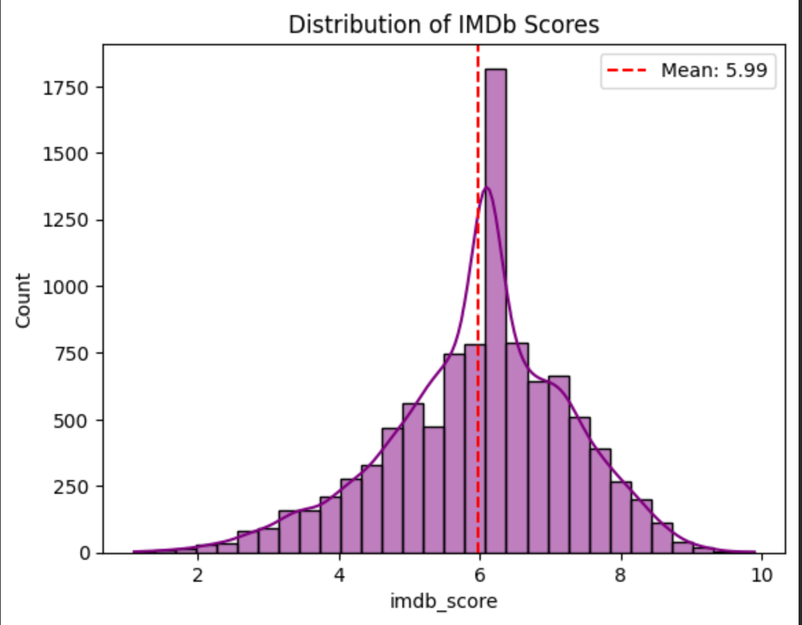
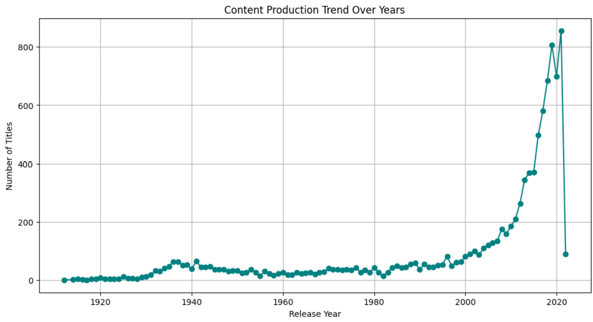
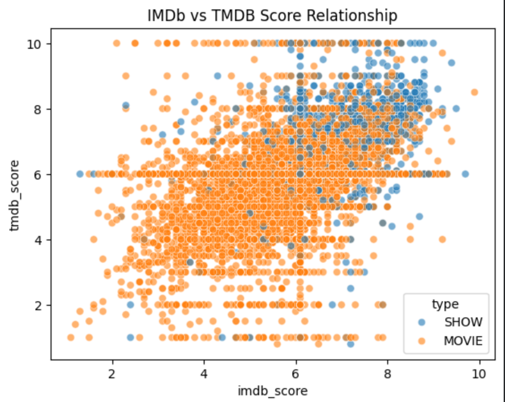
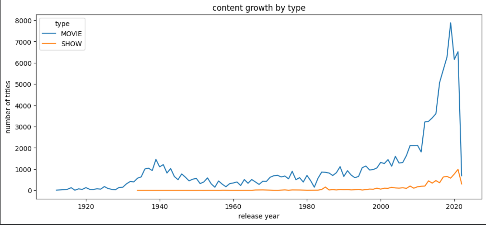

# 📺 Amazon Prime Video Content Analysis

## 📌 Project Overview

This project performs an Exploratory Data Analysis (EDA) on the Amazon Prime Video dataset to uncover insights about content distribution, audience preferences, production trends, ratings, and talent participation across the platform.

The objective is to understand how Amazon Prime structures its content library and identify patterns that can support content strategy, audience engagement, and business decision-making.

Project by Almabetter

---

Notebook - https://colab.research.google.com/drive/1X_Va8XxVxKdPWZ5izJ7jRUo1JDm5lgCj?usp=sharing

VideoExplanation - https://www.youtube.com/watch?v=nQhV__Wf9Hk

---

## 🎯 Business Objective

The analysis aims to answer key business questions such as:

* What is the distribution of Movies vs TV Shows?
* How has content production evolved over time?
* Which genres dominate the platform?
* Which countries contribute the most content?
* How do IMDb and TMDB ratings relate to popularity?
* Which actors and directors appear most frequently?
* What characteristics are associated with highly rated content?

---

## 📂 Dataset Information

### Titles Dataset

Contains metadata for Amazon Prime content:

* id
* title
* type
* description
* release_year
* age_certification
* runtime
* genres
* production_countries
* seasons
* imdb_score
* imdb_votes
* tmdb_score
* tmdb_popularity

### Credits Dataset

Contains cast and crew information:

* person_id
* id
* name
* character
* role

---

## 🛠️ Tech Stack

### Programming & Analysis

* Python
* Pandas
* NumPy

### Data Visualization

* Matplotlib
* Seaborn

### Development Environment

* Google Colab
* Jupyter Notebook

---

## 🔍 Exploratory Data Analysis Workflow

### Data Understanding

* Dataset inspection
* Data types analysis
* Missing value assessment
* Duplicate checking

### Data Cleaning

* Missing value handling
* Structural missing value investigation
* Data consistency validation

### Univariate Analysis

* Content type distribution
* Runtime distribution
* IMDb score distribution
* Release year distribution
* Age certification analysis

### Bivariate Analysis

* Runtime by content type
* IMDb score by content type
* Content trends over time
* Genre performance analysis
* Country-level content distribution

### Multivariate Analysis

* IMDb vs TMDB relationships
* Popularity and rating analysis
* Actor participation analysis
* Director performance analysis
* Content quality exploration

---

## Screenshots

---

## 📊 Key Insights

### Content Strategy

* Movies dominate the Amazon Prime catalog.
* Content production increased significantly after 2010.
* Modern content contributes the largest share of the library.

### Audience Preferences

* Higher-rated content generally receives greater audience attention.
* TV Shows achieve slightly stronger average audience ratings than Movies.

### Geographic Distribution

* The United States contributes the highest volume of content.
* Content production is concentrated among a few major countries.

### Talent Analysis

* A small group of actors and directors repeatedly appear across the platform.
* Experienced creators contribute significantly to highly rated content.

---

## 📈 Visualizations Included

* Movies vs TV Shows Distribution
* Release Year Trend Analysis
* Runtime Distribution
* IMDb Score Distribution
* Correlation Heatmap
* Content by Country
* Genre Analysis
* Actor Participation Analysis
* Director Participation Analysis
* Rating & Popularity Analysis

---

## 💡 Business Recommendations

* Continue investing in high-performing content categories.
* Expand content acquisition from underrepresented regions.
* Leverage successful creative talent for future productions.
* Focus on content attributes associated with higher audience ratings.
* Strengthen audience engagement through highly rated genres and formats.

---

## 🚀 Future Improvements

* Advanced statistical analysis
* Genre-level deep dive
* Predictive modeling for IMDb ratings
* Recommendation system development
* Interactive Power BI Dashboard
* Streamlit Analytics Application

---

## 👨‍💻 Author

**Swapnil Nicolson Dadel**

M.Tech Computer Science | Data Analyst

Skills: Python, SQL, Excel, Power BI, Data Analytics, Machine Learning

---

### ⭐ If you found this project useful, consider giving it a star.
